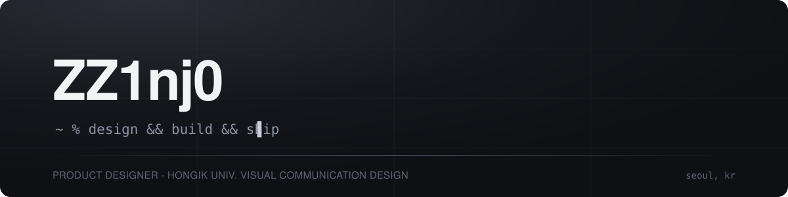
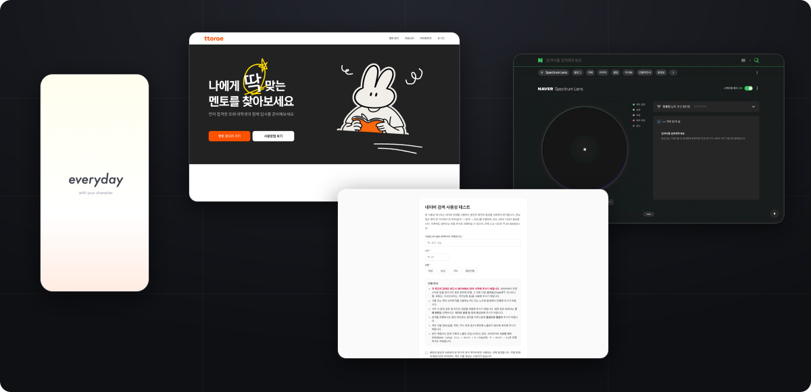

  

Product design student at Hongik Univ. who ships.
I design the product in Figma, then build it and deploy it myself.
Everything below is live.

  

## Projects

| Project | What it is | Built with | Live |
|---|---|---|---|
| **UserTest** | Remote usability testing tool with screen + mic recording | Next.js · AWS S3 · OpenAI | [naverusertest.vercel.app](https://naverusertest.vercel.app) |
| **SpectrumLens** | Opinion mapping for search. Reviews from people like you cluster around you, split by sentiment, demographics and time | JavaScript · Node.js · OpenAI | [spectrumlens.xyz](https://spectrumlens.xyz) |
| **ttorae** | Peer mentor matching platform with auth, school email verification and payments | Next.js · Supabase · PortOne | [ttorae.vercel.app](https://ttorae.vercel.app) |
| **everyday** | AI companion you spend ordinary days with. Character daily-life prototype | Next.js · OpenAI | [everyday-prototype.vercel.app](https://everyday-prototype.vercel.app) |

## Highlights

🏆 **3rd Place** — BUIDL Hack 2026, NEAR AI track

## How I work

Figma first. Then TypeScript, straight to production.
AI-assisted from first sketch to deploy.

<!-- -->
